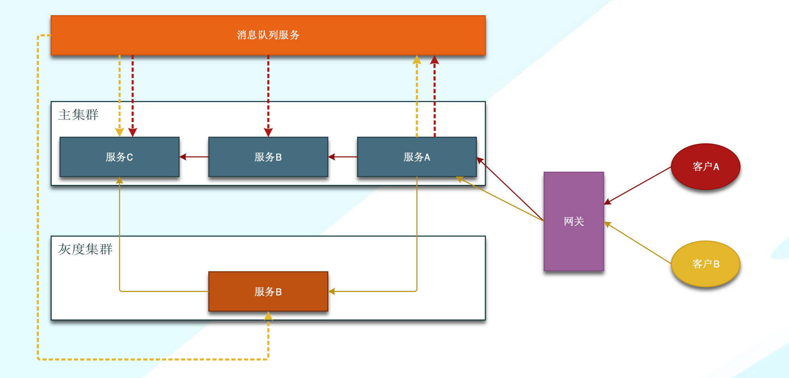

# Multi-Environment Support

## What is Multi-Environment Support

Multi-environment support refers to the ability to deploy multiple versions of services in the same cluster and use the context system to ensure that user requests are processed by the expected version.

Typically, we expect multiple versions to run simultaneously, which requires deploying all application services for the new version in the cluster. With multi-environment support, we can deploy only the changed services in the cluster, and the system can route requests to the correct service for processing.

The diagram below shows the architecture of multi-environment support. Different lines represent the processing paths of requests for different versions:

[](../img/multienv.png)

## Enable Multi-Environment Support

1. Add dependency packages

   ```
   dotnet add package NetCorePal.Extensions.MultiEnv
   dotnet add package NetCorePal.Extensions.MicrosoftServiceDiscovery  // If using Microsoft.Extensions.ServiceDiscovery for service discovery
   ```

2. Add environment context

    ```
    builder.Services.AddContext()  
        .AddEnvContext()    // Add environment support
        .AddTenantContext() 
        .AddCapContextProcessor(); 
    ```
   
3. Add multi-environment support

   You can use `NetCorePalServiceDiscovery` or `Microsoft.Extensions.ServiceDiscovery` for multi-environment service discovery support
   ```csharp
   builder.Services.AddMultiEnv(options =>
     {
         options.ServiceName = "MyServiceName";
         options.ServiceEnv = "main";
     })
     .UseNetCorePalServiceDiscovery(); // Use NetCorePalServiceDiscovery for multi-environment service discovery support
     //.UseMicrosoftServiceDiscovery();  // Use Microsoft.Extensions.ServiceDiscovery for multi-environment service discovery support
   ```
   
4. Use `Microsoft.Extensions.ServiceDiscovery` for multi-environment support
   
   If your service discovery uses `Microsoft.Extensions.ServiceDiscovery`, replace `AddServiceDiscovery` with `AddMultiEnvMicrosoftServiceDiscovery`

    Modify the registration code
    ```csharp
    // Register Microsoft.Extensions.ServiceDiscovery
    builder.Services.AddMultiEnvMicrosoftServiceDiscovery()  // Replace `AddServiceDiscovery` with `AddMultiEnvMicrosoftServiceDiscovery`
        .AddConfigurationServiceEndpointProvider();
    
    // Register HttpClient and configure service discovery
    builder.Services.AddHttpClient<CatalogClient>()
        .AddMultiEnvMicrosoftServiceDiscovery();   // Replace `AddServiceDiscovery` with `AddMultiEnvMicrosoftServiceDiscovery`
    ```

   Note: Currently, multi-environment support based on `Microsoft.Extensions.ServiceDiscovery` relies on a service list that can be explicitly obtained from service registration discovery. Services using `PassThroughServiceEndpointProvider` will not be recognized as valid services because it is impossible to determine whether the service is actually deployed in the cluster. This will result in the inability to perceive the existence of gray versions, and traffic will be directed to the default version.

5. Configure `RabbitMQ` for multi-environment support

   If you are using RabbitMQ, add the following configuration code to support multi-environment
   ```csharp
   builder.Services.AddEnvFixedConnectionChannelPool();
   ```
   
## Use Multi-Environment

The multi-environment system mainly transmits environment information through the environment context. Therefore, you can set the environment information at the system entry point, such as defining a logic in the Yarp gateway:

```csharp
 app.Use((context, next) =>
 {
     var contextAccessor = context.RequestServices.GetRequiredService<IContextAccessor>();
     contextAccessor.SetContext(new EnvContext("v2")); // You can determine the environment version based on the currently logged-in user
     return next();
 });
```

With the above settings, all subsequent requests will be routed to the corresponding `v2` version of the service for processing. If the corresponding service does not have a `v2` version, it will be routed to the default version for processing.


